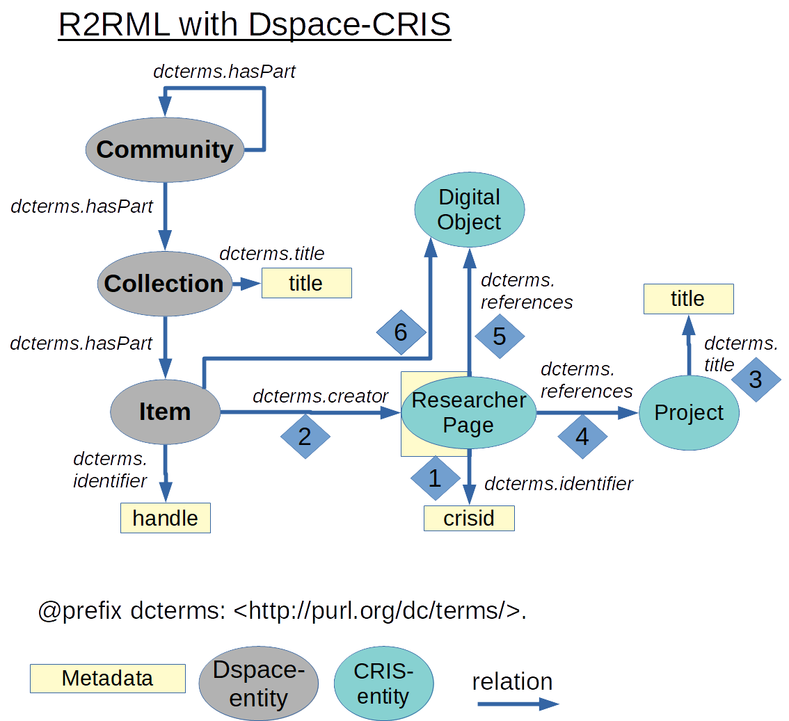

# r2rml-dspace-cris
R2RML Mapping for Dspace-CRIS  
Testet with Dspace-CRIS 5.8  

Can be used for RDF-ization of Dspace-CRIS content.

For testing. 
The mapping provides basic mapping rules and querys for common use cases between the Dspace-CRIS-entities ResearcherPage, Project, OrganizationUnit, and ResearchObject/DigitalObject/2nd Level Entites and their relations to Dspace-entites.  
For real-world-use, every metadata-field and pointer to other entities (by authority-values) have to be added and adapted singularly. The code here can be used as an template. 

* 1. Metadata for Researcherpages
* 2. Relation Item -> Researcherpages using AuthorityValue
* 3. Project/OrganizationUnit
* 4. Relation ResearcherPage -> Project
* 5. DigitalObject/ResearchObject ('bsp') 
* 6. Relation ResearcherPage -> DigitalObject ('bsp')
* 7. Relation Item -> DigitalObject ('event')

A Dump of a small own-created dataset (2-3 entites of every entity-type) was successfully created with the tool https://github.com/nkons/r2rml-parser/.  
R2RML parser also provides a full mapping for the dc-vocabulary for dspace-entities item, collections and communities.

Missing:  
*Nested Objects (no)
*Vocabulary for expressing CERIF-entities. Namespace https://www.eurocris.org/ontologies/cerif/1.6/ not available

